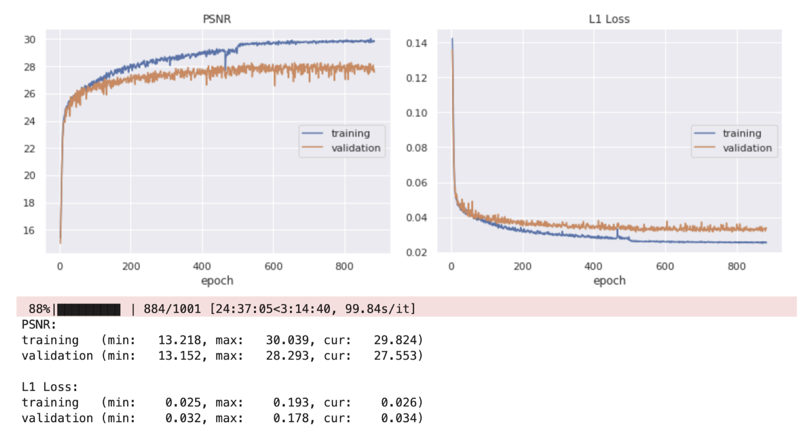
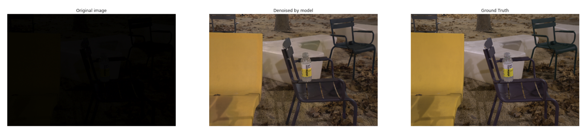
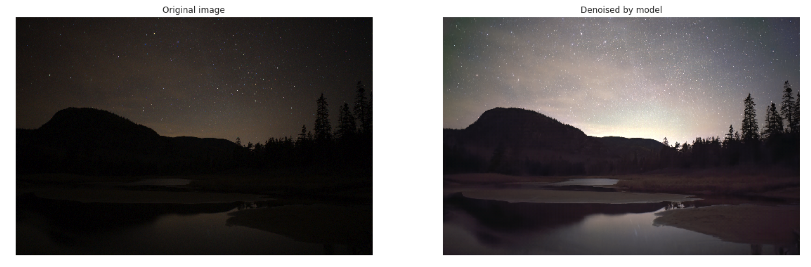
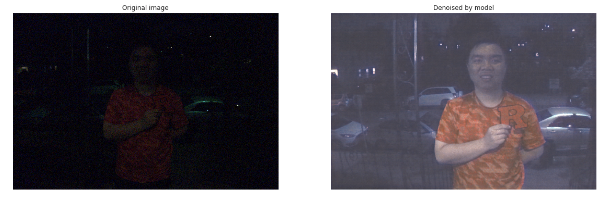

# Learning to See in the Dark
This is my Pytorch implementation of Learning to See in the Dark in CVPR 2018. For more information, please read the Report.pdf and See-In-The-Dark notebook.

[Project Website](http://web.engr.illinois.edu/~cchen156/SID.html)

[Original paper](http://cchen156.web.engr.illinois.edu/paper/18CVPR_SID.pdf) by [Chen Chen](http://cchen156.web.engr.illinois.edu/), [Qifeng Chen](http://cqf.io/), [Jia Xu](http://pages.cs.wisc.edu/~jiaxu/), and [Vladlen Koltun](http://vladlen.info/).

[Original Tensorflow implementation](https://github.com/cchen156/Learning-to-See-in-the-Dark) by Chen Chen

## Results
|                   | PSNR on test set | No. Epochs |
|-------------------|------------------|------------|
| Chen et al.       | 28.88            | 4000       |
| My implementation | 28.83            | 4000       |

**Training PSNR and L1 Loss**

**Denoise a random image in original dataset**

**Denoise a Sony A7sii raw image found on Google**

**Testing cross sensor generalizaion**

*This image was taken on a Sony RX100VI with a 1-inch Bayer sensor*

## Requirements
- 64GB or RAM
- Pytorch 1.0
- Numpy + Rawpy
- Matplotlib
